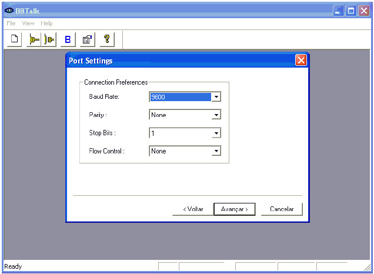
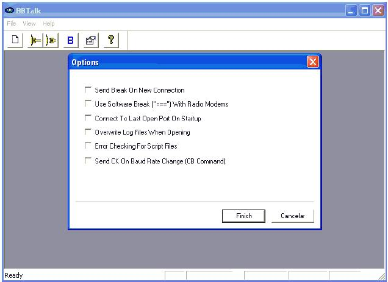
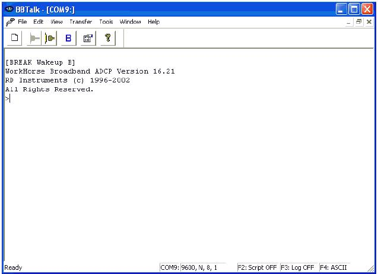
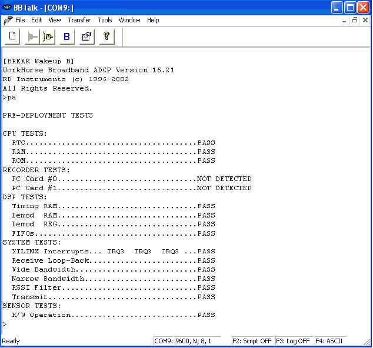
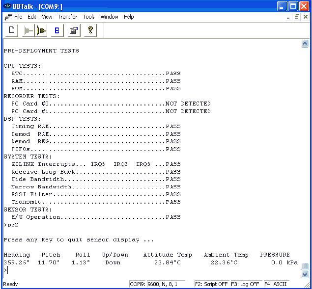

# Acoustic Doppler Current Profiler (ADCP)

There are a large source of information available on the web about ADCPs and its functionalities. Our intention here is to to provide a quick and basic introduction on the operation of this instrument.

For more information about ADCPs, you should visit the <a href="http://www.rdinstruments.com/">Teledyne RD Instruments</a> page.

If you are working with a Vessel Mounted (VM) ADCP, we refer to <a href="http://currents.soest.hawaii.edu/docs/doc/">UHDAS website</a>.

## ADCP first connection

The first step after the proper energy and data cable connection is to open the BBTalk manufacturer software and test the communication with the instrument.

### 1) When you first open BBTalk, you may see the following screen:

*BBTalK first screen.*

*Photo credit:*

At this point, you have to indicate the model and the COM port.

### 2) Configuration of *Baud rate*, *Parity*, *stop Bits*, *Flow Control*:

*Connection configuration of the ADCP*

### 3) Starting ADCP command options on *BBTalk*:

*Screen showing the commands to be sent to the instrument.*

### 4) Now, the sensor can be tested through BBTalk. The first test is the communication test:
It is easily performed by sending a *Break* by clicking on the button `B`:

*The first communication with the instrument being performed.*

### 5) The next test will be if the instrument is operating properly:

The command to check the main parts of the ADCP as well as the signal path is the `PA`. This command checks the *CPU*,*DSP*, the *System* itself, the *storage devices* and the *sensor*:

*`PA` test to check the equipment functionality.*

### 6) Attitude test: Heading (compass), Pitch and Roll.

The command `PC2` is sent to check *Heading*,*Pitch* and *Roll*. While performing this test, one can move the sensor in it's 3 axis and check if the output values are changing.

*`PC2` test showing the movements of the sensor.*
